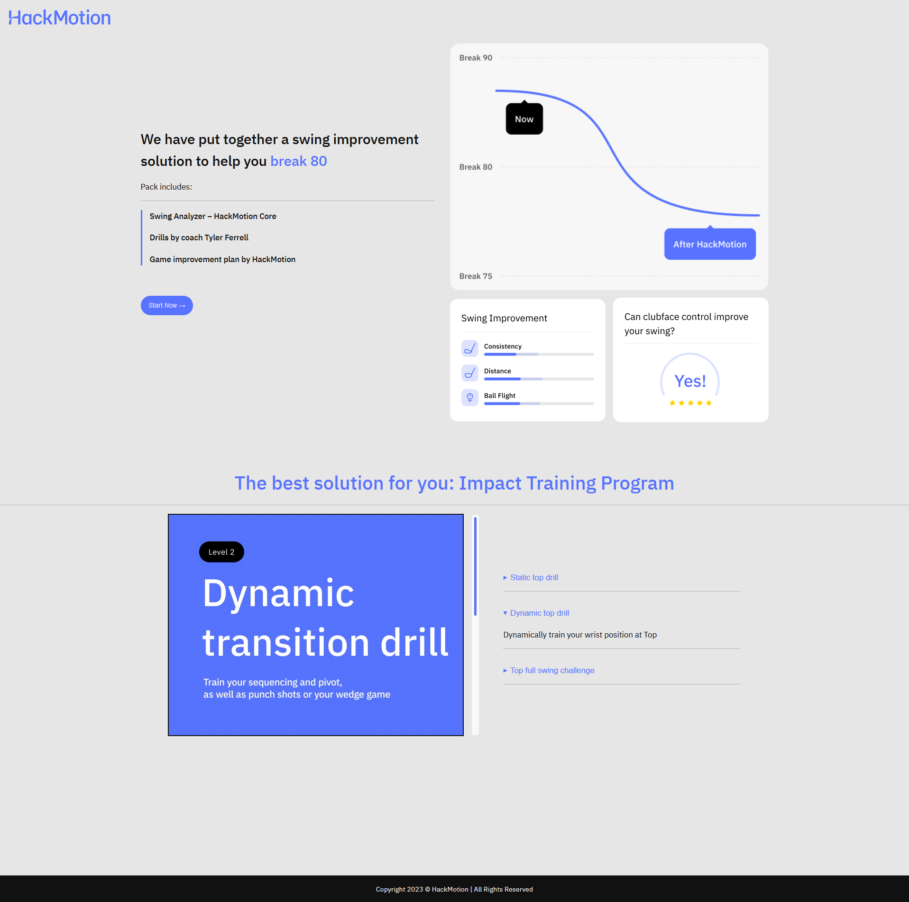
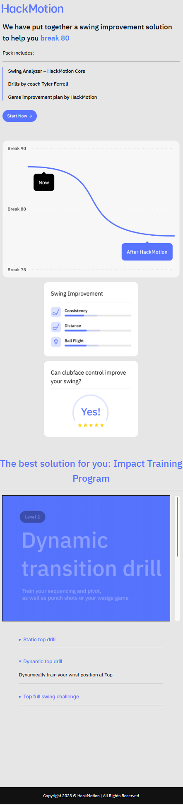

#### The finished template looks like this

Everything is rendered on the server.

### Dynamic content
For the dynamic text I created a custom block which is added as a plugin. The block is rendered with a [render.php](wordpress/wp-content/plugins/text-from-url/src/render.php) file, which gets the value of the "break" attribute in the url and places it after "break".
Technically this allows for any string to be placed after "break", which could be restricted to 80, 90, 100, Par for a production version.

### Interactive video
For the interactive video I used built-in video and details blocks. The progress bar is a simple custom HTML div element with an inner div for the progress. For interactivity, I extended the [functions.php](wordpress/wp-content/themes/hackmotion_theme/functions.php)
file. It adds a JS script to the website. The script finds the video, details and progress bar elements and adds 2 event listeners. The first event listener is called when the video time changes (a few times per second). It updates the height of the progress bar
and checks if any of the timestamps have been met. If so, it adds the "open" attribute to the appropriate detail element. The second event listener is called when the video ends. It sends a trigger to the analytics plugin that the video has ended.

### Analytics
The above features were easy to implement from scratch, but that is not the case for analytics. I did not want to use Google Analytics because it seemed overkill for this project, so I looked for a self-hosted alternative. I found matomo which I added to the project.
It provides page views with all of the required user data out of the box. For the video event I needed to add a custom tag, which was pretty straightforward and then, as explained above, when the video is completed, a trigger is passed to add the tag to the user.
So the page view is automatically linked to the video completion event.

### .env file
I know that .env files should never be added to git, but since this is not a real project, I added it for completeness and convenience.

### Conclusion
While doing the project I solved each problem on its own and ended up using three different approaches - a custom block/plugin with php, a scipt with JS and an existing plugin. In my opinion these are appropraite solutions, but it's possible that they do not
follow wordpress best practices. Wordpress best practices are something I need to learn more about.
